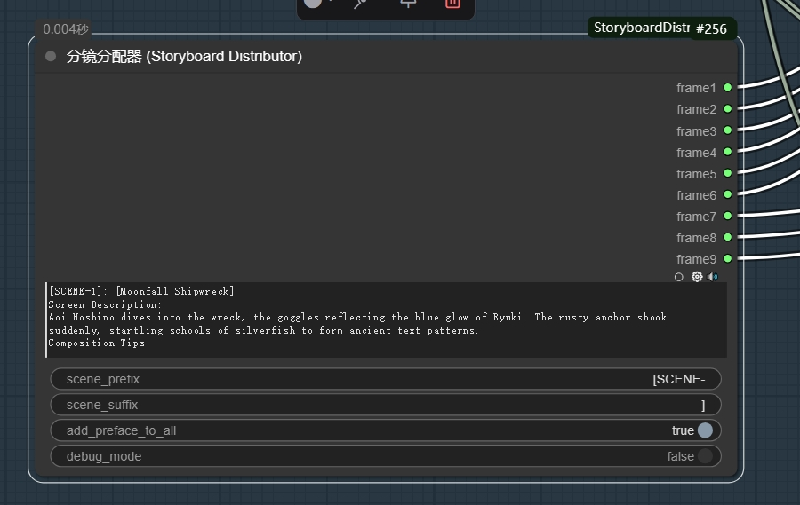

# ComfyUI-StoryboardDistributor

一个 ComfyUI 插件，可以自动将分镜内容分配给9个分镜节点。


## 介绍

当你使用 ComfyUI 制作多个分镜时，需要手动将每个分镜内容复制粘贴到各个分镜节点中。这个插件可以自动完成这个工作，将标记了场景编号的文本自动分配到对应的9个输出中。

## 功能

- 自动识别格式为 `[SCENE-X]` 的场景标记，其中 X 是 1 到 9 之间的数字
- 提取每个场景内容并分配给对应的输出
- 支持自定义场景标记前缀和后缀
- 将场景标记前的文本作为前言添加到每个场景
- 可选是否将前言添加到所有场景
- 直观的用户界面和帮助信息
- 支持插入示例文本
- 调试模式，帮助排查问题

## 截图

### 节点界面


## 安装方法

### 方法一：使用 Git 克隆

```bash
cd ComfyUI/custom_nodes/
git clone https://github.com/yourusername/ComfyUI-StoryboardDistributor.git
```

### 方法二：下载 ZIP 文件

1. 从 GitHub 下载最新的 ZIP 文件：[下载链接](https://github.com/yourusername/ComfyUI-StoryboardDistributor/archive/refs/heads/main.zip)
2. 解压文件到 ComfyUI 的 `custom_nodes` 目录
3. 重命名文件夹为 `ComfyUI-StoryboardDistributor`（如果需要）

### 安装后

1. 重启 ComfyUI
2. 在节点菜单中查找 "分镜分配器" 或 "Storyboard Distributor"

## 使用方法

1. 在节点菜单中搜索 "分镜分配器" 或 "Storyboard Distributor"
2. 使用方法:
   - 将你的分镜文本粘贴到 `storyboard_text` 输入框
   - 每个场景应当使用 `[SCENE-X]` 标记，其中 X 是 1 到 9 的数字
   - 节点会将内容自动分配给9个对应的输出
   - 每个输出可以连接到对应的分镜节点

## 参数说明

- **storyboard_text**：分镜文本内容，包含多个场景
- **scene_prefix**：场景标记前缀，默认为 `[SCENE-`
- **scene_suffix**：场景标记后缀，默认为 `]`
- **add_preface_to_all**：是否将前言添加到所有场景，默认为 `true`
- **debug_mode**：是否启用调试模式，默认为 `false`

## 示例

输入:
```
Star (6 year old girl)
Style: red dot bow hair clip + light blue bib + yellow rain boots.

[SCENE-1] Picture: The magic forest in the morning is shrouded in gray fog.
Character action: Starlet crouches at the entrance of the forest.

[SCENE-2] Scene: Through the thorn bushes, encounter the "fog maze tree".
Action: Starlet opens the way with scissors in a cloth bag.

[SCENE-3] Scene: Gem returns, forest returns color, sunlight penetrates leaves.
Action: Little star claps with purr, bow is blown by wind.
```

输出:
分镜1、分镜2、分镜3将分别收到对应的内容，包括前言部分。

## 更新历史

### 版本 1.0.0 (2023-03-31)

- 初始发布
- 支持9个分镜场景的自动分配
- 改进的用户界面
- 添加了帮助信息和示例文本

## 注意事项

- 场景编号必须在1到9之间
- 如果没有某个编号的场景，对应的输出将为空字符串或只包含前言
- 可以通过节点的可选参数自定义场景标记的前缀和后缀

## 许可证

MIT License # ComfyUI-StoryboardDistributor
